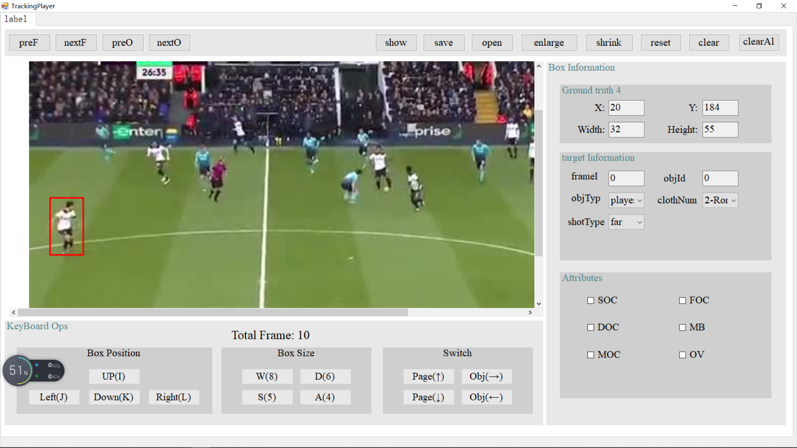
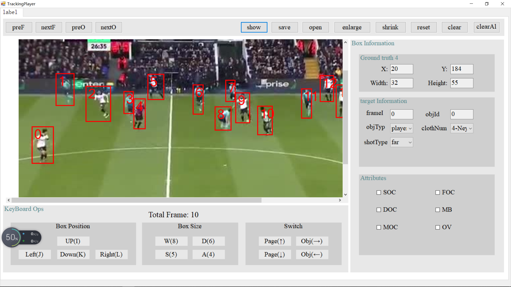

# 多目标跟踪足球比赛标注工具

这是一款针对足球比赛图片的多目标跟踪标注工具，能够实现对目标的位置大小、目标的属性以及目标的状态的标注。

## 界面介绍

整个界面分为4个部分，分别是：

1. 图片展示区：中间这块展示需要标注的图片的区域，可以通过鼠标选择进行目标选取。
2. 标注功能区：上面的按钮部分，每个按钮在标注中都起到作用。
    - preF:上一帧
    - nextF:下一帧
    - preO:上一个目标
    - nextO:下一个目标
    - show: 展示当前帧全部目标
    - save:保存标注（需要手动保存，最好一段时间保存一次）
    - open:打开需要标注的图片序列所在文件夹
    - enlarge:放大图片用于精细操作
    - shrink:缩小图片
    - reset:重置大小
    - clear:清除当前帧当前目标的标框，x,y,w,h全置0
    - clearAll:清除当前帧的所有标注过的目标。
3. 标注信息区：右边展示标注目标的信息，信息包括：
    - Groundtruth 4
        - x,y,w,h：表示标注图片的位置以及大小。
    - target Information
        - frameId: 当前图片的id，表示当前处理的是整个序列的第几帧。
        - objId: 当前操作目标的id，表示当前帧的第几个标注目标。
        - objType: 标注目标类型：**0-球员 1-球**
        - clothNum: 如果标注的目标是球员的话表示该球员的球衣号码。这里需要以一个球员-球衣号码的文档在图片序列文件夹中，文档每一行的内容为：球员姓名,球衣号码
        - shotType: 镜头类型：**0-远镜头 1-中镜头 2-远镜头**
    - Attribute
        - SOC(Same Team Occlusion):目标是否发生同队遮挡
        - DOC(Different Team Occlusion):目标是否发生异队遮挡
        - MOC(Multi team Occlusion):目标是否发生多人遮挡
        - FOC(Full Occlusion):目标是否发生完全遮挡
        - MB(Motion Blur):目标是否发生运动模糊
        - OV(Out of View):目标是否不在画面上
4. 快捷键提示区：下面这部分表示一些可用的快捷键：
    - BoxPosition:标框位置微调
        - I/小键盘↑键：减小y
        - K/小键盘↓键：增大y
        - J/小键盘←键：减小x
        - L/小键盘→键：增大x
    - BoxSize:标框大小微调
        - W/小键盘↑键：减小h
        - S/小键盘↓键：增大h
        - A/小键盘←键：减小w
        - D/小键盘→键：增大w
    - Switch:页面以及目标切换
        - ↑：上一帧
        - ↓：下一帧
        - ←：上一个目标
        - →：下一个目标

## 注意事项

1. 所有修改需要手动保存，所有最好隔一段时间保存一次。
2. 点击下一帧时如果这一帧没有标注会自动继承上一帧的所有目标的标注，如果不需要自动继承需要手动点击clearAll按钮全部删除。
3. 本工具有球衣**自动回溯**功能，就是前面由于前面看不清的号码的球员在后续帧中被标记的话在点击保存按钮后会自动补全，补全的规则是从第一帧开始遍历，如果遍历到该球员有号码的帧，则所有已经标记的帧的该球员的球衣会被标记到该号码。